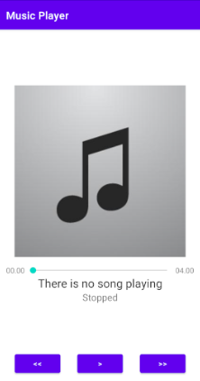

# Music Player

> Basic Android Player App.

This is a common music player app, with four predefined mp3 songs, you can see the track information on the screen and enjoy the music.

## Built With

- Kotlin
- Android Studio

## Getting Started

Get a local copy running the following command.

`git clone https://gitlab.com/meme_es/MusicPlayer.git`

### Prerequisites

- Android Studio

### Usage

Open the project using Android Studio, select an Android Virtual Device (AVD), press the run triangle button, and let the IDE make the rest.

Once you are on the first screen you can press play to start to listen to music predefined. There are just four short tracks, the play button performs the pause action, and if you want to change press the next or previous button.

## Authors

👤 **Meme**

- GitLab: [@meme_es](https://gitlab.com/meme_es)
- Linkedin: [linkedin](https://www.linkedin.com/in/manuel-elias/)

## 🤝 Contributing

Contributions, issues, and feature requests are welcome!

Feel free to check the [issues page](https://gitlab.com/meme_es/MarsMission/-/issues).

## Show your support

Give a ⭐️ if you like this project!

## 📝 License

This project is unlicensed.
